# คู่มือการติดตั้ง Anydesk  
  Anydesk เป็นโปรแกรมสำหรับควบคุมเครื่องทางไกล เหมาะกับการใช้งาน การจัดการเครื่องที่อยู่ห่างไกลเป็นอย่างมาก?? โดยจะแบ่งเป็นหัวข้อการติดตั้งดังนี้  

## การ Download anydesk

  เข้าไปที่เว็บไซต์ https://anydesk.com/ ด้วยโปรแกรมเข้าอินเตอร์เน็ตอะไรก็ได้ ในที่นี้จะใช้ Microsoft Edge  
  `https://anydesk.com`

  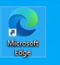  

  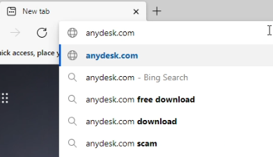  

  กดที่ปุ่ม Download  

  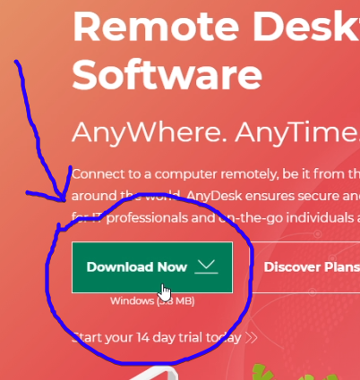  

  รอจน Downalod เสร็จ แล้วกดเปิด Anydesk ขึ้นมา  

  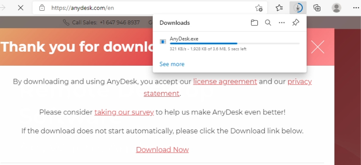  

  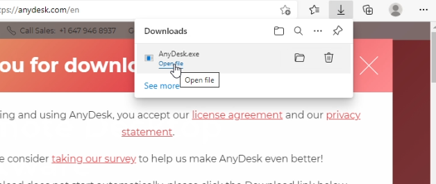  

  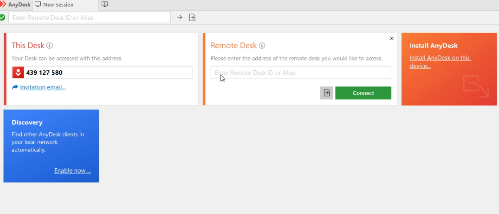  

## การ Install anydesk

  กดที่ Install AnyDesk on this device...  

  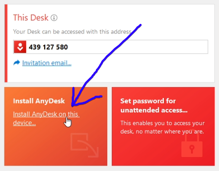  

  กดที่ ปุ่ม Accept & Install  

  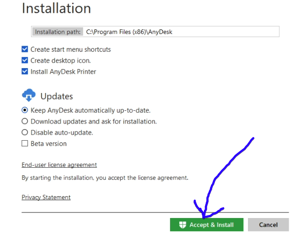  

  กด Yes  

  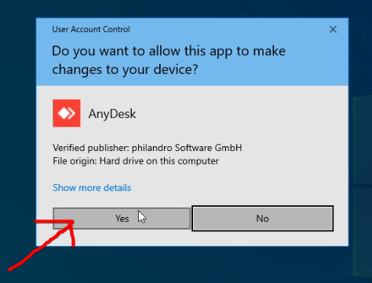  

  รอจนติดตั้งเสร็จ ระบบจะเปิดหน้า Anydesk ขึ้นมาใหม่  

  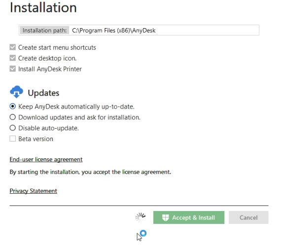  

  กด Install  

  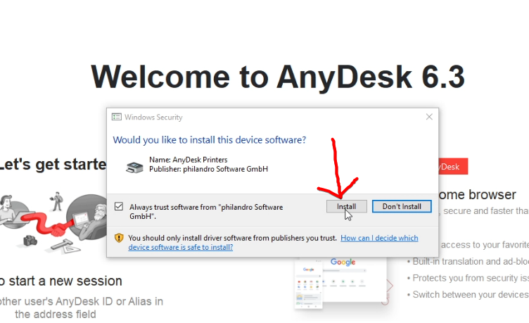  

## การกำหนดรหัสผ่านเผื่อใช้ในการควบคุมภายหลัง

  ที่หน้าจอขวาบน จะมีปุ่มขีดสามขีด ให้คลิกตรงนั้น  

  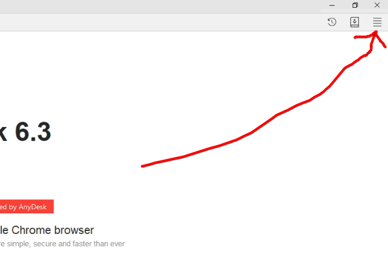  

  คลิก Settings  

  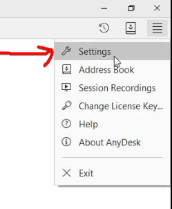  

  จะมีหน้าจอ Setting ขึ้นมา ตรงเมนูทางด้านซ้ายให้เลือก Security  

  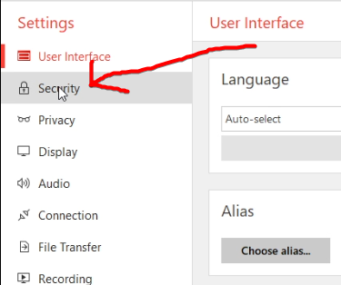  

  คลิก Unlock Security Settings ...  

  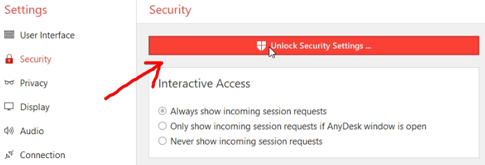  

  ตอบ Yes  

    

  คลิก Enable unattended accss  

  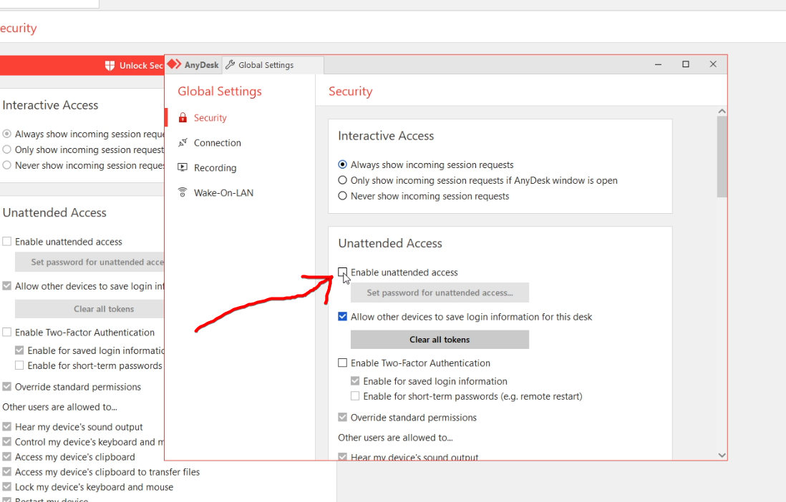  

  ใส่รหัสผ่าน แล้วจดไว้  

  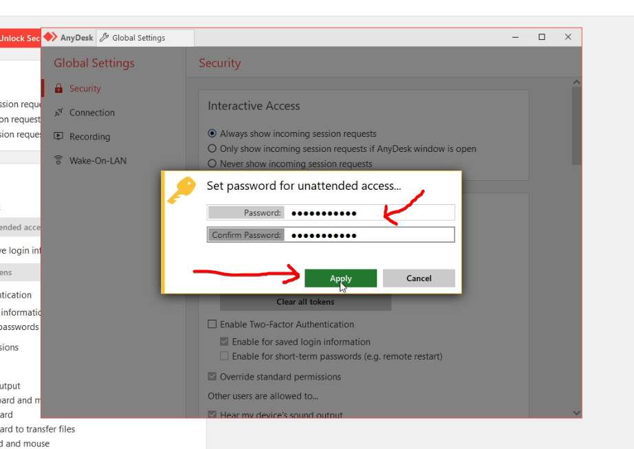  

  กดปุ่ม X ในหน้าจอเล็ก  

  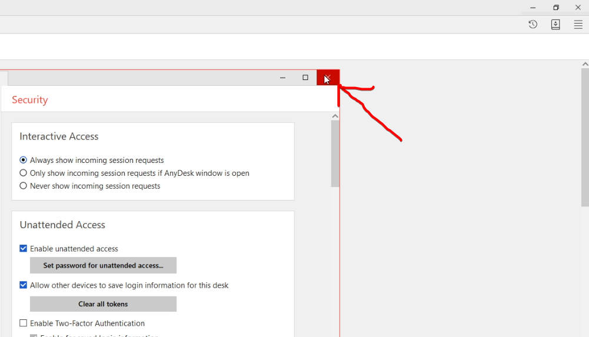  

  เมนูด้านบน คลิก New Session  

  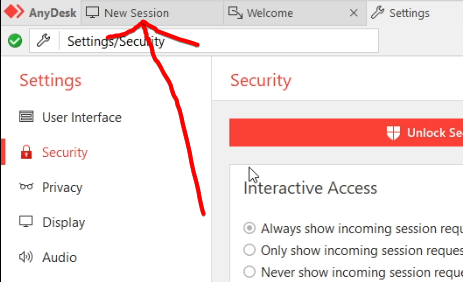  

  จดเลข เพื่อใช้ในการควบคุมเครื่อง  

  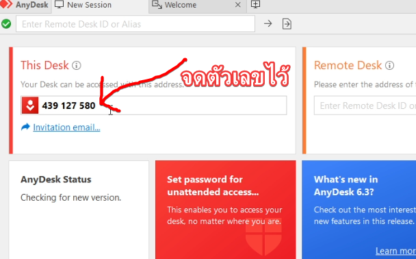  
