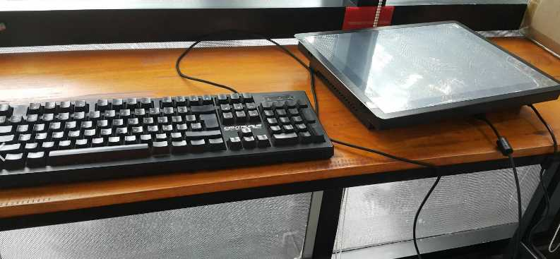
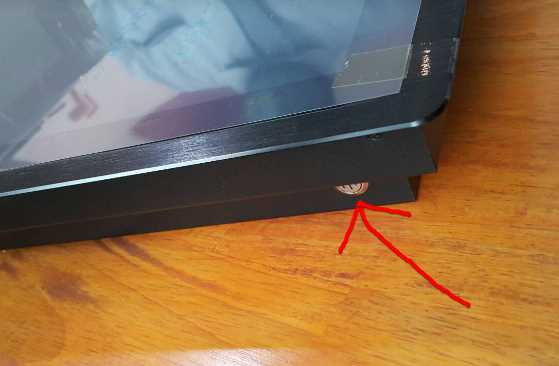
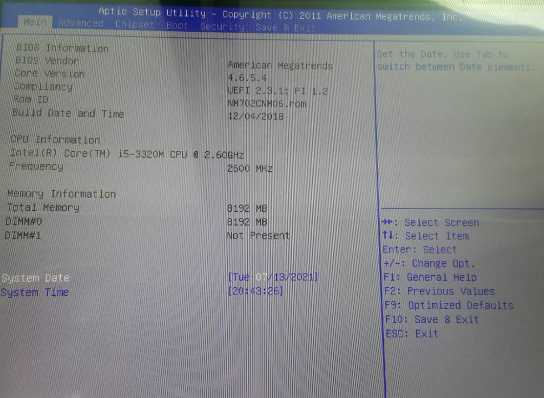
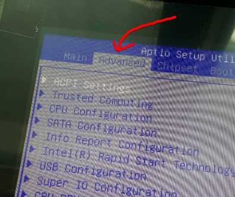
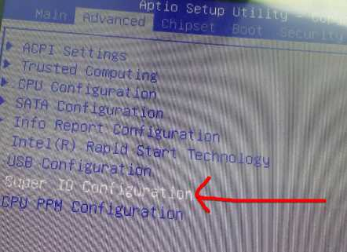
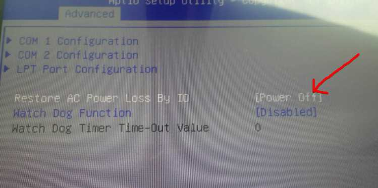
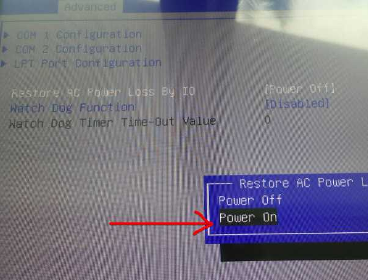
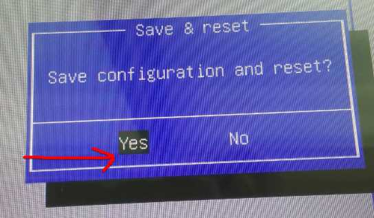

# การตั้งค่าเมื่อมีไฟเข้าระบบ ให้เปิดเครื่องอัตโนมัติ  

เสียบ Keyboard เข้ากับตัว Panel PC  

  

กดปุ่มเปิดเครื่อง พร้อมกับกดปุ่ม Delete บน Keyboard รัวๆ ต่อเนื่องกัน  

  
  

จะเข้าสู่หน้าจัดการ Bios  

  

ใช้ปุ่ม Keyboard เลื่อนขวาไปที่ `Advanced`  

  
  

ใช้ปุ่ม Keyboard ลูกศรลงเลื่อนไปที่ `Super IO Configuration`  แล้วกด Enter  

  
  

ใช้ปุ่ม Keyboard ลูกศรลงเลื่อนไปที่ `Restore AC Power Loss By IO`  แล้วกด Enter  

  
  

ใช้ปุ่ม Keyboard ลูกศรลงเลื่อนไปที่ `Power ON`  แล้วกด Enter  

  
  

กดปุ่ม `F10` บน Keyboard แล้วตอบ `Yes`  

  
