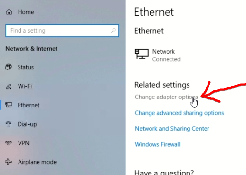

# การตั้งค่า ip-address

  สามารถกำหนดค่าตัวแปรได้ดังนี้

  | Field | value  |
  | :-: |:-|
  | IP address  |  192.168.6.8  |
  | Subnet mask  | 255.255.255.0  |
  | Default gateway | 192.168.6.1 |
  | Preferred DNS server | 192.168.6.1 |  

ที่ช่องค้นหาของ Windows ให้ค้นหาคำว่า `ether` แล้วเลือกรายการ `Change Ethernet settings`  

  

  

คลิกที่ `Change adapter options`  

  

คลิกเม้าส์ขวาที่ `Ethernet`  

  

คลิกที่ `Properties`  

  

จะมีหน้าต่าง Ethernet Status เปิดขึ้นมาให้คลิกที่ `Properties`  

  

เลือก Internet Protocal Version 4 (TCP/IPv4) และ คลิกที่ Properties  

  

กำหนดค่าตามตาราง  

  | Field | value  |
  | :-: |:-|
  | IP address  |  192.168.6.8  |
  | Subnet mask  | 255.255.255.0  |
  | Default gateway | 192.168.6.1 |
  | Preferred DNS server | 192.168.6.1 |  

  

เสร็จแล้วให้คลิก `OK`  

  

กดปิดหน้าต่างการตั้งค่า เสร็จสิ้นการกำหนดค่า ip address  

  
