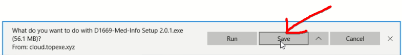

# การติดตั้ง Med-Info
การติดตั้ง Med-Info สำหรับ Panel PC  

  Download ไฟล์ติดตั้งที่ link
    - link หลัก https://s.hii.in.th/minfo  
    `https://s.hii.in.th/minfo`  
    - link สำรองถ้าอันบนไม่ได้ https://s.hii.in.th/minfo2  
    `https://s.hii.in.th/minfo2`  

1. เปิด Internet Browser ขึ้นมาแล้วใส่ link `s.hii.in.th/minfo` ลงในช่องแล้วกด Enter  

  

  

2. คลิกที่ `D1669-Med-Info-Setup` เพื่อทำการ Download  

  

3. คลิก `Save`  

  

4. ช่วงรอการ Download ขึ้นอยู่กับความเร็ว Internet  

  

5. หลังจาก Download เสร็จแล้วให้คลิก `Run`  

  

6. คลิกที่ `More info`  

  

7. คลิกที่ `Run anyway`  

  

8. ระบบจะติดตั้งอัตโนมัติ ให้รอจนติดตั้งเสร็จ  

  

9. หลังติดตั้งเสร็จระบบจะเปิดหน้าต่างขึ้นมาอัตโนมัติ  

  
