# การติดตั้ง OBS  
การติดตั้ง OBS Studio สำหรับ Panel PC  
เราใช้ Software OBS Studio สำหรับการจำลองกล้อง Webcam เพื่อให้สามารถใช้งานระบบได้ ซึ่งในตรงนี้ สามารถใช้ Software ตัวอื่นทดแทนได้ แต่สาเหตุที่ใช้ เพราะว่า OBS Studio นั้นใช้งานได้ฟรี ไม่มีค่าใช้จ่าย  

1. เปิด Microsoft Edge หรือ Browser ตัวอื่นก็ได้  
  ในช่องค้นหาให้พิมพ์ว่า `obs` แล้วกด Enter  

    

  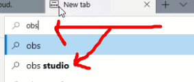  

2. มองหาหัวข้อ `Open Broadcaster Software | OBS` คลิกที่ `Download` ตามภาพ  

  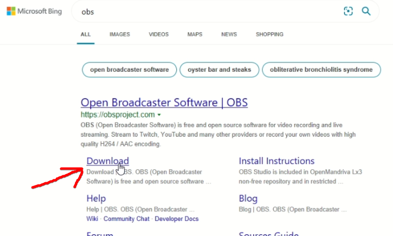  

  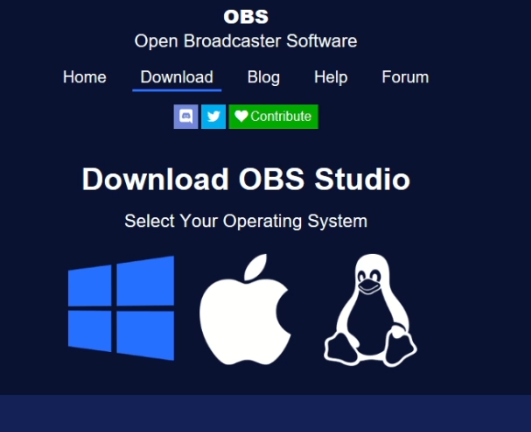  

3. เลื่อนหน้าลงมาด้านล่างหาข้อความ `Download Installer` ทำการคลิก ตามภาพ  

  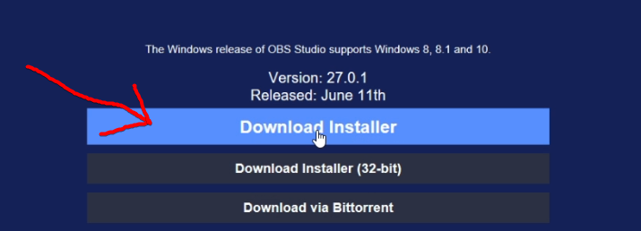  

4. กดปุ่ม `Save` เพื่อทำการบันทึก  

    

5. รอจนการ Download เสร็จสิ้น  

  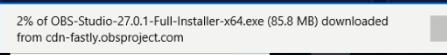  

6. เมื่อ Download เสร็จจะขึ้นปุ่ม `Run` ให้คลิกตามภาพ  

  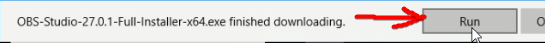  

7. คลิก `Yes`

  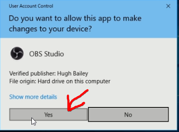  

8. คลิก `Next`  

  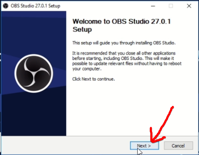  

9. คลิก `Next`  

  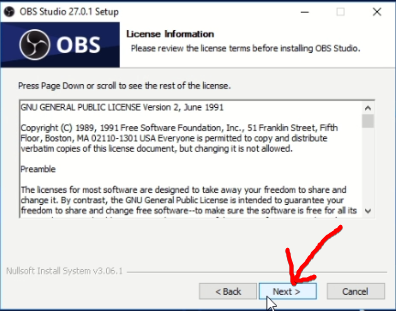  

10. คลิก `Install`  

  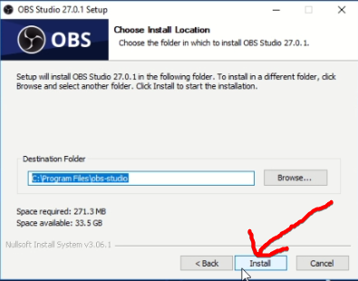  

11. รอจนการติดตั้งเสร็จ  

  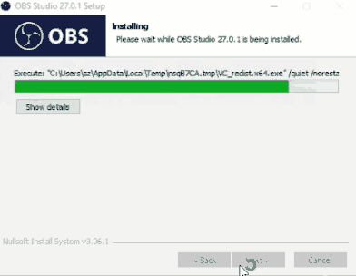  

12. หลังติดตั้งเสร็จคลิก `Finish`  

  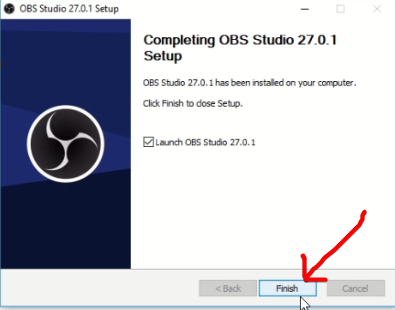  

13. คลิกตัวเลือก `I will only by using the virtual camera` และกด Next   ตามภาพ  

  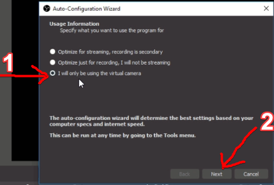  

14. คลิก `Apply Setting`  

  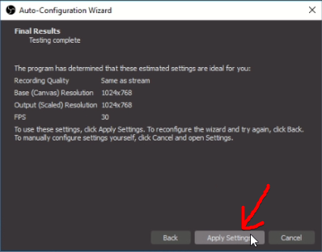  

15. เสร็จสิ้นการติดตั้งคลิกที่ `X` ตรงมุมขวาบนของ OBS เพื่อทำการปิดโปรแกรม  

  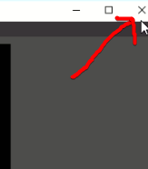  
