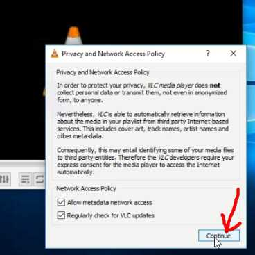

# การติดตั้ง vlc  

เปิด Microsoft Edge หรือ Browser ตัวอื่นก็ได้  
  ในช่องค้นหาให้พิมพ์ว่า `vlc` แล้วกด Enter  

  

  

คลิกที่ `VLC media player`  

  

คลิกที่ `Download VLC`  

  

หากไฟล์ไม่ Download ให้คลิกที่ `click hear` ตามภาพ  

  

  

รอจน Download เสร็จ  

  

คลิก `Run`  

  

รอซักพักจะขึ้นหน้าต่างให้ตอบ `Yes`  

  

คลิก `OK`  

  

คลิก `Next >`  

  

คลิก `Next >`  

  

คลิก `Next >`  

  

คลิก `Install`  

  

ระหว่างนี้ให้รอจนการติดตั้งเสร็จ  

  

คลิก `Finish`  

  

คลิก `Continue`  

  

คลิก `X` เพื่อปิดหน้าต่าง  

  
