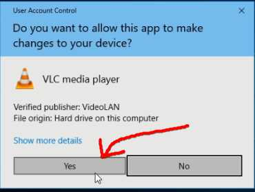

# การติดตั้ง vlc  

1. เปิด Microsoft Edge หรือ Browser ตัวอื่นก็ได้  
  ในช่องค้นหาให้พิมพ์ว่า `vlc` แล้วกด Enter  

  

  

2. คลิกที่ `VLC media player`  

  

3. คลิกที่ `Download VLC`  

  

4. หากไฟล์ไม่ Download ให้คลิกที่ `click hear` ตามภาพ  

  

  

5. รอจน Download เสร็จ  

  

6. คลิก `Run`  

  

7. รอซักพักจะขึ้นหน้าต่างให้ตอบ `Yes`  

  

8. คลิก `OK`  

  

9. คลิก `Next >`  

  

10. คลิก `Next >`  

  

11. คลิก `Next >`  

  

12. คลิก `Install`  

  

13. ระหว่างนี้ให้รอจนการติดตั้งเสร็จ  

  

14. คลิก `Finish`  

  

15. คลิก `Continue`  

  

16. คลิก `X` เพื่อปิดหน้าต่าง  

  
